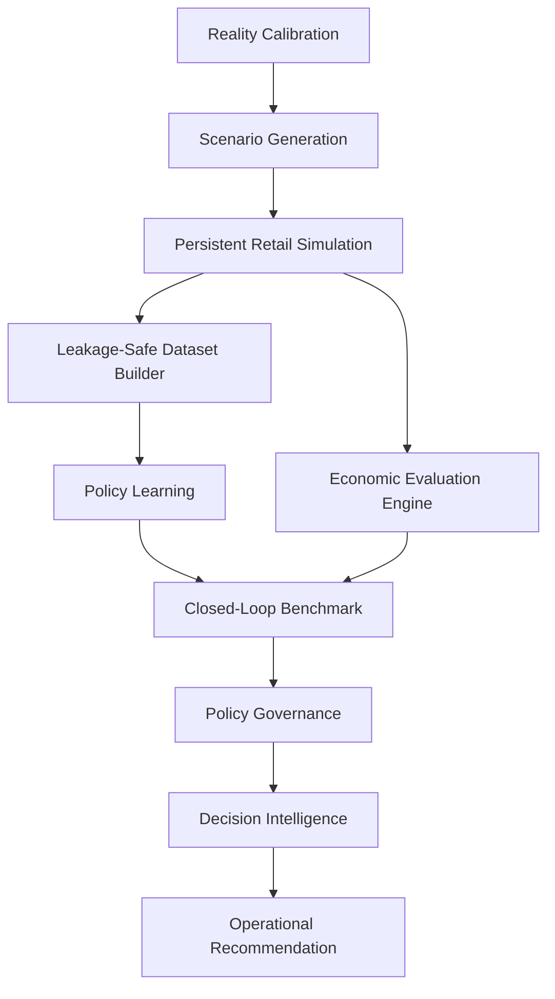
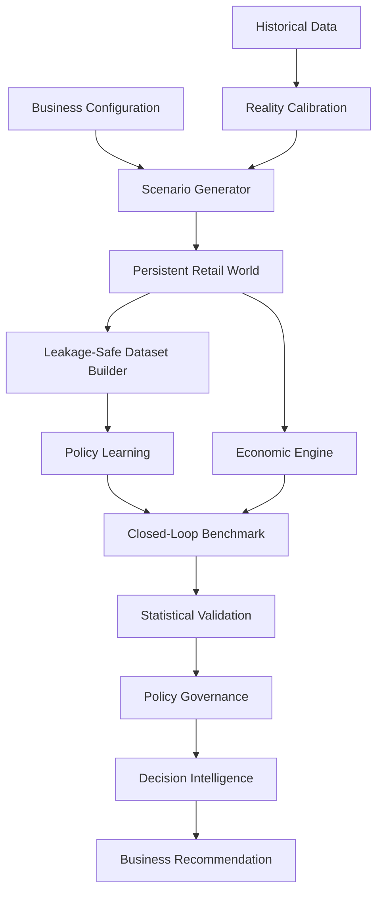
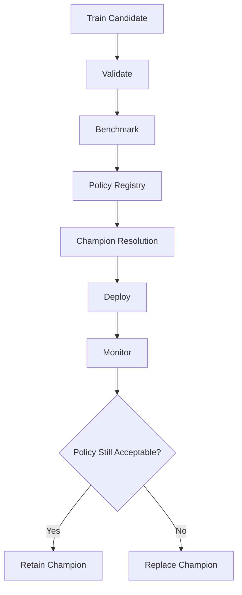
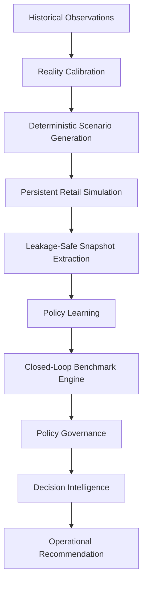

# Stockout Decision Intelligence Platform

[](https://github.com/xavi092000/stockout-decision-intelligence/actions/workflows/ci.yml)


> A production-oriented AI Decision Intelligence Platform that combines deterministic retail simulation, leakage-safe policy learning, closed-loop benchmarking, policy governance, and explainable operational recommendations.

---

## Executive Summary

Most inventory optimization projects stop after predicting whether a stockout may occur.

Real retail operations are fundamentally different.

Every operational decision - placing an order, expediting a shipment, transferring inventory, or deliberately taking no action - changes the future state of the business. These decisions affect customer service, logistics costs, inventory availability, cash flow, and ultimately financial performance.

This repository focuses on that operational decision problem.

Instead of optimizing prediction accuracy alone, it provides a complete Decision Intelligence workflow capable of learning, evaluating, benchmarking, governing, and explaining inventory policies inside a deterministic retail environment.

The platform combines software engineering and machine learning into a modular architecture where every component can evolve independently while preserving reproducibility and temporal integrity.

---

## Highlights

- Deterministic retail simulation
- Persistent inventory world
- Leakage-safe policy learning
- Closed-loop policy benchmarking
- Statistical validation
- Policy governance
- Explainable Decision Intelligence
- 103 automated tests

---

## Recruiter Snapshot

| Production Capability | Evidence |
|---|---|
| Deterministic simulation | Reproducible 365-day retail episodes |
| Leakage-safe machine learning | Decision-time features with episode isolation |
| Closed-loop evaluation | Policies executed inside the persistent simulator |
| Statistical validation | 30 unseen seeds and 95% confidence intervals |
| Policy governance | Registry, candidate tracking, and champion resolution |
| Explainable decisions | Operational recommendations and alternatives |
| Quality engineering | 103 automated tests, Docker, and CI |

> **Business result:** the learned policy produced a mean Net Business Value improvement of **+$206,585.95**, while increasing service level by **2.11 percentage points** across 30 unseen simulation seeds.

---
## Engineering Metrics

| Metric | Value |
|---|---:|
| Simulation Horizon | 365 days |
| Benchmark Seeds | 30 unseen episodes |
| Supported Actions | 4 |
| Automated Tests | 103 |
| Policy Evaluation | Closed-loop |
| Dataset Construction | Leakage-safe |
| Benchmark Validation | 95% confidence intervals |
| Architecture | Modular Decision Intelligence Platform |

---

## Why This Platform Is Different

Traditional inventory projects generally answer a single question:

> **Will a stockout happen?**

This platform answers a fundamentally different question:

> **Given the current business state, what operational decision maximizes long-term business value?**

Instead of evaluating isolated predictions, candidate policies are executed inside the same persistent retail simulation where every action changes future inventory states.

Because every policy experiences identical operating conditions, business performance can be compared objectively through measurable financial outcomes rather than prediction metrics alone.

The result is a complete AI Decision Intelligence Platform rather than a standalone machine learning model.

---

## Repository Philosophy

This repository intentionally prioritizes engineering quality over model complexity.

Every component is designed to be deterministic, independently testable, and replaceable without affecting the rest of the platform.

Rather than maximizing a benchmark score, the objective is to demonstrate production-oriented AI engineering practices including reproducibility, modularity, governance, benchmarking, and explainable operational decision support.

---

## High-Level Architecture



## Platform Layers

| Layer | Responsibility |
|---|---|
| Reality Calibration | Learn realistic operating distributions from historical observations |
| Scenario Generation | Produce deterministic business episodes |
| Persistent Simulation | Execute sequential inventory operations |
| Economic Evaluation | Measure business consequences independently from ML logic |
| Dataset Builder | Produce leakage-safe training snapshots |
| Policy Learning | Train operational decision policies |
| Benchmark Engine | Compare candidate policies objectively |
| Policy Governance | Control policy lifecycle |
| Decision Intelligence | Generate explainable business recommendations |

---

## Benchmark Highlights

The current benchmark evaluates policies across **30 unseen simulation seeds**, ensuring that every candidate policy experiences identical operating conditions.

| Metric | Improvement |
|---|---:|
| Mean Net Business Value | **+$206,585.95** |
| Mean Service Level | **+2.11 percentage points** |
| Value Win Rate | **83.33%** |
| Service-Level Win Rate | **93.33%** |
| Joint Win Rate | **83.33%** |

The learned policy improves service level and business value while accepting a measured increase in operating cost.

---

## Core Capabilities

| Capability | Status |
|---|---:|
| Reality calibration | Complete |
| Deterministic scenario generation | Complete |
| Persistent 365-day retail simulation | Complete |
| Leakage-safe dataset construction | Complete |
| Policy learning | Complete |
| Closed-loop multi-seed benchmarking | Complete |
| Statistical validation | Complete |
| Policy registry and champion resolution | Complete |
| Decision Intelligence outputs | Complete |
| Automated testing | 103 tests passing |

---

## Engineering Problem

Inventory optimization is not a prediction problem in isolation.

Every operational decision modifies the future evolution of the supply chain:

- inventory levels
- supplier pipelines
- transportation costs
- service levels
- stockout risk
- working capital
- financial performance

These effects accumulate over time.

Evaluating individual predictions therefore provides only a partial view of operational performance.

The objective of this platform is to evaluate complete decision policies inside a persistent retail environment where every decision influences future business states.

This transforms the problem from supervised prediction into operational Decision Intelligence.

---

## Platform Architecture



The platform is organized into independent layers.

Each layer has a single engineering responsibility and can evolve without requiring changes throughout the rest of the system.

### 1. Reality Calibration

Historical observations are never replayed directly.

Instead, they are transformed into reusable calibration profiles describing realistic operating behavior.

Calibration includes:

- customer demand
- supplier lead times
- weather variability
- promotions
- seasonal patterns
- macro-economic regimes
- business constraints

Separating calibration from simulation allows unlimited deterministic scenario generation while preventing direct memorization of historical timelines.

### 2. Scenario Generation

The scenario engine generates independent business episodes using deterministic random seeds.

Each generated episode contains realistic combinations of:

- stores
- products
- suppliers
- weather conditions
- promotions
- demand fluctuations
- economic regimes

Because generation is deterministic, identical configurations reproduce identical business episodes.

### 3. Persistent Retail Simulation

The simulator models inventory evolution over an entire operating horizon.

Unlike isolated forecasting datasets, inventory evolves continuously and each decision changes future system state.

The simulator maintains:

- inventory positions
- supplier orders
- lead times
- deliveries
- transfers
- customer demand
- financial state

Supported operational decisions include:

| Action | Operational Meaning |
|---|---|
| `DO_NOTHING` | Preserve the current inventory strategy |
| `ORDER_NORMAL` | Place a standard replenishment order |
| `ORDER_EXPEDITE` | Place an accelerated replenishment order |
| `TRANSFER_STOCK` | Rebalance inventory between stores |

### 4. Economic Evaluation Engine

Business performance is evaluated independently from machine learning.

Tracked metrics include:

- revenue
- holding cost
- replenishment cost
- expedite cost
- transfer cost
- lost sales
- stockout penalties
- Net Business Value

Because financial assumptions are isolated from learning logic, alternative cost models can be introduced without redesigning the AI pipeline.

### 5. Leakage-Safe Dataset Builder

Training datasets are extracted only from information available at decision time.

Forbidden variables include:

- future demand
- future weather
- future deliveries
- future inventory
- future actions
- future business outcomes

Complete episode isolation is maintained across training, validation, and testing.

### 6. Policy Learning

Operational policies are learned from decision-time snapshots.

The learning layer intentionally remains model-independent.

The current implementation uses a supervised baseline, while the architecture allows future replacement by:

- gradient boosting
- random forests
- reinforcement learning
- contextual bandits
- optimization-based policies

without modifying downstream benchmarking, governance, or Decision Intelligence layers.

### 7. Closed-Loop Benchmark Engine

Every candidate policy is replayed inside the same simulated environment.

The following remain fixed:

- calibration profiles
- random seeds
- business rules
- evaluation horizon
- economic assumptions

Only the decision policy changes.

Reported metrics include Net Business Value, service level, stockout events, unmet demand, total cost, win rate, downside rate, standard deviation, and 95% confidence intervals.

---

## Benchmark Results

Benchmarking is performed by replaying every candidate policy across **30 previously unseen simulation seeds**.

Each policy experiences identical operating conditions, ensuring that observed performance differences are attributable to decision quality rather than environmental variation.

### Benchmark Summary

| Metric | Rule-Based | ML Policy |
|---|---:|---:|
| Service Level | 73.60% | **75.71%** |
| Net Business Value | $3,608,227 | **$3,814,813** |
| Total Cost | $7,323,873 | $7,429,025 |
| Stockout Events | 11,634 | **10,396** |
| Unmet Demand | 194,004 | **178,535** |

### Measured Policy Improvements

| Improvement | Result |
|---|---:|
| Mean Net Business Value | **+$206,585.95** |
| 95% Confidence Interval | **[$134,399; $278,772]** |
| Mean Service-Level Improvement | **+2.11 percentage points** |
| Value Win Rate | **83.33%** |
| Service-Level Win Rate | **93.33%** |
| Joint Win Rate | **83.33%** |

The benchmark intentionally exposes the trade-off between stronger business outcomes and higher operating cost rather than reducing performance to a single metric.

---

## Policy Governance

Machine learning models are treated as operational assets rather than standalone artifacts.



Governance responsibilities include:

- policy registration
- benchmark evidence
- version management
- candidate tracking
- champion resolution
- deployment traceability
- lifecycle history

---

## Decision Intelligence

Machine learning predicts actions. Decision Intelligence produces operational recommendations.

The platform converts predictions into structured business guidance suitable for planners, analysts, or downstream systems.

Representative outputs include:

- recommended action
- prediction confidence
- alternative actions
- counterfactual comparisons
- business risk indicators
- executive recommendation

Keeping this layer independent allows explanation logic to evolve without affecting optimization or benchmarking.

---

## Validation Strategy

Every engineering layer is validated independently.

Validation includes:

- deterministic replay
- dataset integrity audits
- leakage detection
- episode isolation
- causal consistency
- benchmark reproducibility
- regression testing

The repository currently passes **103 automated tests**.

---

## Production Engineering Principles

| Principle | Objective |
|---|---|
| Deterministic execution | Reproducible experiments |
| Temporal integrity | Prevent information leakage |
| Modular architecture | Independent evolution of components |
| Closed-loop evaluation | Measure operational outcomes |
| Statistical validation | Quantify uncertainty |
| Policy governance | Controlled lifecycle management |
| Explainability | Human-readable recommendations |
| Automated testing | Continuous reliability |

---

## Design Trade-Offs

Several engineering decisions intentionally favor reproducibility and operational realism over short-term model performance:

- deterministic simulation instead of uncontrolled randomness
- temporal integrity instead of feature leakage
- policy evaluation instead of prediction-only metrics
- business value optimization instead of accuracy optimization
- modular architecture instead of tightly coupled pipelines

These trade-offs make benchmark results more trustworthy and the platform easier to extend.

---

## Engineering Decisions

### Why deterministic simulation?

Deterministic execution enables reproducible experiments, fair policy comparison, regression testing, and statistically valid benchmarking.

### Why persistent inventory?

Inventory systems exhibit delayed effects. Orders placed today influence inventory availability several days later, and a persistent simulator captures those dependencies.

### Why evaluate policies instead of predictions?

Organizations deploy operational strategies rather than isolated predictions. Business value emerges from thousands of sequential decisions.

### Why separate financial evaluation?

Business assumptions evolve over time. Keeping the economic engine independent allows financial models to change without retraining or redesigning the AI pipeline.

### Why start with supervised learning?

A supervised baseline provides deterministic behavior, interpretability, rapid experimentation, and a strong reference point for future reinforcement learning research.

### Why governance?

Operational deployment requires versioning, benchmark evidence, traceability, and controlled promotion of candidate policies.

---

## Repository Structure

The repository is organized around the main engineering responsibilities of the platform:

```text
.
|-- .github/                 # CI workflows and Docker validation
|-- artifacts/               # Trained models, benchmarks, and validation reports
|-- docs/                    # Scientific and engineering audits
|-- simulation/              # Core simulation, ML, governance, and Decision Intelligence
|-- tests/                   # Automated regression and validation tests
|-- Dockerfile               # Reproducible container environment
|-- requirements.txt         # Python dependencies
|-- pytest.ini               # Test configuration
`-- README.md
```

The architecture is organized by engineering responsibility rather than by deployment unit. This keeps simulation, policy learning, benchmarking, governance, validation, and Decision Intelligence independently testable and replaceable.
## Technology Stack

| Capability | Technology |
|---|---|
| Programming Language | Python |
| Machine Learning | scikit-learn |
| Numerical Computing | NumPy |
| Data Processing | pandas |
| API | FastAPI |
| Testing | pytest |
| Containerization | Docker |
| Documentation | Markdown and Mermaid |
| Benchmark Engine | Custom closed-loop evaluation |
| Simulation Engine | Custom deterministic retail simulator |
| Policy Governance | Custom registry and champion resolution |
| Version Control | Git |

---

## End-to-End Workflow



Every stage has a clearly defined responsibility, enabling independent validation, testing, and future evolution.

---

## Engineering Characteristics

The platform demonstrates engineering practices commonly found in production AI systems:

- deterministic execution
- reproducible experimentation
- temporal data integrity
- modular architecture
- explainable recommendations
- independent validation
- policy lifecycle management
- statistical benchmarking
- regression protection

---

## What This Project Demonstrates

This repository demonstrates significantly more than a predictive machine learning model.

Key engineering capabilities include:

- deterministic retail simulation
- temporal state management
- leakage-safe dataset construction
- supervised policy learning
- closed-loop policy benchmarking
- statistical performance validation
- policy governance and lifecycle management
- explainable decision support
- modular platform architecture
- automated testing and regression protection

Collectively, these components illustrate the engineering of an operational Decision Intelligence Platform rather than an isolated ML pipeline.

---

## Future Evolution

Potential future capabilities include:

- reinforcement learning agents
- contextual bandits
- probabilistic demand forecasting
- multi-echelon inventory optimization
- supplier reliability modeling
- experiment tracking
- cloud-native orchestration
- real-time operational data ingestion
- human approval workflows
- online policy evaluation

Because responsibilities remain separated, these capabilities can be introduced without redesigning the existing platform.

---

## Design Principles

- deterministic execution over hidden randomness
- reproducibility over convenience
- business outcomes over isolated prediction metrics
- modular services over tightly coupled pipelines
- policy evaluation over model evaluation
- explainability over opaque recommendations
- governance over uncontrolled deployment
- statistical evidence over anecdotal performance

---

## Conclusion

The Stockout Decision Intelligence Platform demonstrates how modern AI systems extend beyond prediction into operational decision support.

Rather than optimizing a single machine learning metric, the platform integrates deterministic simulation, leakage-safe learning, closed-loop benchmarking, policy governance, statistical validation, and explainable recommendations into a unified engineering workflow.

The resulting architecture enables candidate policies to be trained, evaluated, compared, governed, and continuously improved using measurable business outcomes rather than isolated model accuracy.

---

**Key Takeaway**

This repository demonstrates how production AI systems can be engineered, benchmarked, governed, validated, and continuously improved through reproducible Decision Intelligence workflows rather than isolated predictive models.
